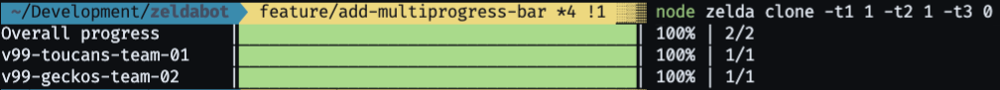

# zeldabot

[contributors-shield]: https://img.shields.io/github/contributors/chingu-x/zeldabot.svg?style=for-the-badge
[contributors-url]: https://github.com/chingu-x/zeldabot/graphs/contributors
[forks-shield]: https://img.shields.io/github/forks/chingu-x/zeldabot.svg?style=for-the-badge
[forks-url]: https://github.com/chingu-x/zeldabot/network/members
[stars-shield]: https://img.shields.io/github/stars/chingu-x/zeldabot.svg?style=for-the-badge
[stars-url]: https://github.com/chingu-x/zeldabot/stargazers
[issues-shield]: https://img.shields.io/github/issues/chingu-x/zeldabot.svg?style=for-the-badge
[issues-url]: https://github.com/chingu-x/zeldabot/issues

[![Contributors][contributors-shield]][contributors-url]
[![Forks][forks-shield]][forks-url]
[![Stargazers][stars-shield]][stars-url]
[![Issues][issues-shield]][issues-url]

Zeldabot creates Chingu Voyage repos in GitHub from a template repository. It's purpose is
to automate the process to reduce the amount of manual time spent preparing for Voyages,
while improving quality and reducing the chance of errors.

[Process Overview](#process-overview) - [Installation](#installation) - [Usage](#usage) - [Release History](#release-history) - [License](#license)



## Process Overview

### Validate

Using the GitHub user names in the Voyage config file, validate each to make
sure they are valid. Since Chingus manually enter their GitHub user names when
they signup for a Voyage data entry errors are sometimes made.

### Clone

Zeldabot uses a template repository as a model to create one repo for each
Voyage team. To achieve this it does the following for each of the repos
it creates:

1. Generates a unique name for the Github repo and team
2. Create an empty repo in the designated GitHub organization

### Add Issues

One issue for each of the steps in the first two sprints, as documented in the
[Voyage Guide](https://github.com/chingu-voyages/Handbook/blob/main/docs/guides/voyage/voyage.md#the-voyage-process),
are copied from the template repo to each of theteam repos.

This is a separate step from cloning since it's very GitHub API intensive and
subject to rate limit overruns.

1. Clone issue labels from the template repo to the new repository
2. Clone milestones from the template repo to the new repository
3. Clone issue from the template repo to the new repository, adding labels and milestones

### Authorize

Once the team repos have been created the `authorize` command is used to grant
administrative access to the team repos.

1. Github account names are mapped to teams in the `config/vnn_teams_users.json`
file.
2. Create an empty team in the designated gitHub organization and add it to the
repo with *'Admin'* privileges
3. For each user add them to the appropriate team.

## Installation

To install this app:

```bash
git clone https://github.com/chingu-voyagetest/voyage-template.git
npm i
```

To run the app check out the information in the *'Usage'* section below.

Zeldabot requires the use of a GitHub personal access token. You can follow
this [procedure](https://docs.github.com/en/github/authenticating-to-github/creating-a-personal-access-token) to set one up.

You will also need to grant admin access on the organization new repos will be
created in to the GitHub id that owns the personal access token.

## Usage

Zeldabot is a command line application (CLI). The basic command to run it is:

```bash
node zeldabot <command> <option flags>
```

Where `<command>` is one of:

- `validate`
- `clone`
- `add_issues`
- `authorize`

### Options

Before running it you'll first need to identify option values you'll using
in both the command line and the CLI `.env` file.

| CLI Option | `.env` Parm | Description |
|------------|-------------|-------------|
| -d, --debug | DEBUG       | Debug switch to add runtime info to console (YES/NO) |
| -r, --restart | RESTART   | Restart processing at a specific team number |
| -v, --voyage | VOYAGE      | Voyage name (e.g. v99) |
| -t1, --t1-count | NO_TIER1_TEAMS | Number of Tier 1 team repos to create |
| -t2, --t2-count | NO_TIER2_TEAMS | Number of Tier 2 team repos to create |
| -t3, --t3-count | NO_TIER3_TEAMS | Number of Tier 3 team repos to create |
| -n1, --t1-name | TIER1_NAME | Name of Tier 1 team used to create repo/team name |
| -n2, --t2-name | TIER2_NAME | Name of Tier 2 team used to create repo/team name |
| -n3, --t3-name | TIER3_NAME | Name of Tier 3 team used to create repo/team name |
| -s, --github-token | GITHUB_TOKEN | GitHub personal access token used for authentication |
| -o, --github-org | GITHUB_ORG | GitHub organization name containing the template+new repos |
| -t, --github-template | GITHUB_TEMPLATE_REPO | GitHub template repo name |
| -c, --config | CONFIG | Path to the config file containing teams info |

It's important to keep in mind that options you supply on the command line
ALWAYS override the same option you specify in the `.env` file.

`env.sample` in the root of the project contains a sample of how to set up a `.env` file.

### CLI Examples

#### Example #1 - Validate

Assuming that you've set up a `.env` file with the variables:

```bash
VOYAGE=v99
TIER1_NAME=toucans
TIER2_NAME=geckos
TIER3_NAME=bears
GITHUB_ORG=chingu-voyagetest
GITHUB_TEMPLATE_REPO=voyage-template 
GITHUB_TOKEN=the-token-value
```

the `validate` command can be run as follows to generate a list of GitHub user
names that are unknown to GitHub. This can then be used to determine the
correct user names.

```bash
node zeldabot validate 
```

#### Example #1 - Clone

Assuming that you've set up a `.env` file with the variables:

```bash
VOYAGE=v99
TIER1_NAME=toucans
TIER2_NAME=geckos
TIER3_NAME=bears
GITHUB_ORG=chingu-voyagetest
GITHUB_TEMPLATE_REPO=voyage-template 
GITHUB_TOKEN=the-token-value
```

the command to run Zeldabot can be as simple as the following to set up repositories
for 3 tier 1, 2 tier 2, and 4 tier 3 teams.

```bash
node zeldabot clone -t1 3 -t2 2 -t3 4
```

Running this command would create the following repo:

- chingu-voyagetest/v99-toucans-team-01
- chingu-voyagetest/v99-toucans-team-02
- chingu-voyagetest/v99-toucans-team-03
- chingu-voyagetest/v99-geckos-team-04
- chingu-voyagetest/v99-geckos-team-05
- chingu-voyagetest/v99-bears-team-06
- chingu-voyagetest/v99-bears-team-07
- chingu-voyagetest/v99-bears-team-08
- chingu-voyagetest/v99-bears-team-09

#### Example #2 - Clone

A slightly more complicated example assumes that even with the same `.env` file
you would like to create a set of repos with different team names. Since
command line options always override the same settings in the `.env` file it is
is not necessary to update the `.env` file.

```bash
node zeldabot clone -t1 1 -t2 1 -t3 1 -n1 possums -n2 cobras -n3 kangaroos
```

Running this command would create the following repo:

- chingu-voyagetest/v99-possums-team-01
- chingu-voyagetest/v99-cobras-team-02
- chingu-voyagetest/v99-kangaroos-team-03

#### Example #3 - Clone

Assume that a previous run was started with this command:

```bash
node zeldabot clone -t1 1 -t2 2 -t3 3 
```

but prematurely terminated when an error occurred adding Bears team #5.

After fixing the issue this run can be resumed at Bears team #5 using the
command parameter `-r 5`:

```bash
node zeldabot clone -t1 1 -t2 2 -t3 3 -r 5
```

#### Example #4 - Add Issues

Assuming that you've set up a `.env` file with the variables:

```bash
VOYAGE=v99
TIER1_NAME=toucans
TIER2_NAME=geckos
TIER3_NAME=bears
GITHUB_ORG=chingu-voyagetest
GITHUB_TEMPLATE_REPO=voyage-template 
GITHUB_TOKEN=the-token-value
```

the command to run Zeldabot can be as simple as the following to add issues in
the template repo to each of this Voyages team repositories.

```bash
node zeldabot add_issues -t1 3 -t2 2 -t3 4
```

#### Example #5 - Authorize

Assuming that you've set up a `.env` file with the variables:

```bash
VOYAGE=v99
TIER1_NAME=toucans
TIER2_NAME=geckos
TIER3_NAME=bears
GITHUB_ORG=chingu-voyagetest
GITHUB_TEMPLATE_REPO=voyage-template 
GITHUB_TOKEN=the-token-value
```

the command to run Zeldabot can be as simple as the following to add Chingus in
the teams to to each of this Voyages organizational teams in GitHub.

```bash
node zeldabot authorize -t1 3 -t2 2 -t3 4
```

## Release History

You can find what changed, when in the [release history](./docs/RELEASE_HISTORY.md)

## License

Copyright 2023 <COPYRIGHT Chingu, Inc.>

Redistribution and use in source and binary forms, with or without modification,
are permitted provided that the following conditions are met:

1. Redistributions of source code must retain the above copyright notice, this
list of conditions and the following disclaimer.

2. Redistributions in binary form must reproduce the above copyright notice,
this list of conditions and the following disclaimer in the documentation
and/or other materials provided with the distribution.

3. Neither the name of the copyright holder nor the names of its contributors
may be used to endorse or promote products derived from this software without
specific prior written permission.

THIS SOFTWARE IS PROVIDED BY THE COPYRIGHT HOLDERS AND CONTRIBUTORS "AS IS" AND
ANY EXPRESS OR IMPLIED WARRANTIES, INCLUDING, BUT NOT LIMITED TO, THE IMPLIED
WARRANTIES OF MERCHANTABILITY AND FITNESS FOR A PARTICULAR PURPOSE ARE
DISCLAIMED. IN NO EVENT SHALL THE COPYRIGHT HOLDER OR CONTRIBUTORS BE LIABLE
FOR ANY DIRECT, INDIRECT, INCIDENTAL, SPECIAL, EXEMPLARY, OR CONSEQUENTIAL
DAMAGES (INCLUDING, BUT NOT LIMITED TO, PROCUREMENT OF SUBSTITUTE GOODS OR
SERVICES; LOSS OF USE, DATA, OR PROFITS; OR BUSINESS INTERRUPTION) HOWEVER
CAUSED AND ON ANY THEORY OF LIABILITY, WHETHER IN CONTRACT, STRICT LIABILITY,
OR TORT (INCLUDING NEGLIGENCE OR OTHERWISE) ARISING IN ANY WAY OUT OF THE USE
OF THIS SOFTWARE, EVEN IF ADVISED OF THE POSSIBILITY OF SUCH DAMAGE.
